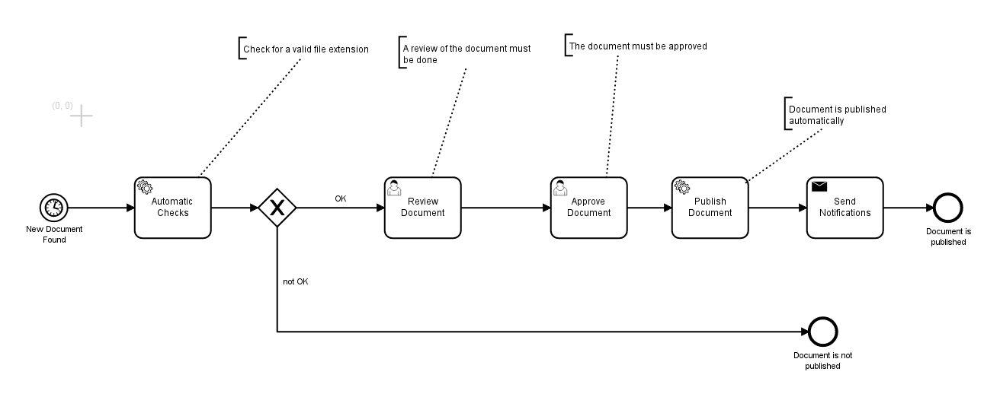

== appNG Camunda example

This is an example application demonstrating the integration of Camunda BPMN.

== Prerequisites
All you need is an appNG instance running with the https://github.com/appNG/appng/tree/master/appng-application-camunda[Camunda integration] and the https://github.com/appNG/appng-scheduler[appng-scheduler].

=== How it works
This example uses a simple example process located link:src/main/resources/appng-camunda-example.bpmn[here].

* a user with the role *Submitter* uploads a new document
* an appNG `ScheduledJob` finds the uploaded document and starts the Camunda process instance
* the service task 'Automatic Checks' checks if the document's file type is valid
* the user task 'Review Document' is executed by a user with the role *Reviewer*
* the user task 'Approve Document' is executed by a user with the role *Editor*
* the service task 'Publish Document' publishes the document
* the send task 'Send Notifications' notifies some receivers via e-mail

NOTE: You might want to create a user group and a corresponding user for each of the roles mentioned above. Threfore use the appNG manager, the CLI or appNGizer.

=== Building
Run `mvn package` to build and deploy the resulting application archive through a local repository.